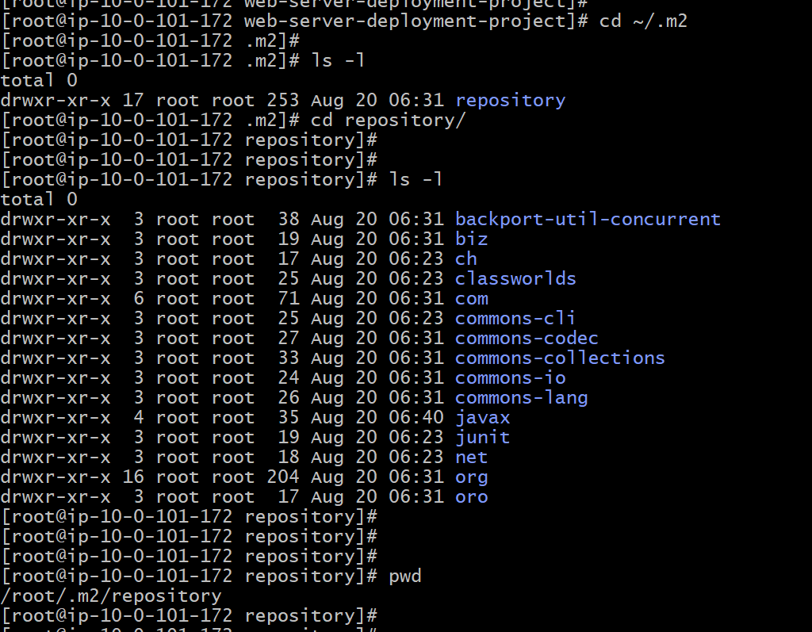

# Issues

```
Downloaded: https://repo.maven.apache.org/maven2/org/sonatype/plexus/plexus-build-api/0.0.4/plexus-build-api-0.0.4.jar (7 KB at 475.0 KB/sec)
Downloaded: https://repo.maven.apache.org/maven2/org/codehaus/plexus/plexus-interpolation/1.13/plexus-interpolation-1.13.jar (60 KB at 5420.5 KB/sec)
Downloaded: https://repo.maven.apache.org/maven2/org/apache/maven/shared/maven-filtering/1.0/maven-filtering-1.0.jar (42 KB at 2620.7 KB/sec)
Downloaded: https://repo.maven.apache.org/maven2/junit/junit/3.8.1/junit-3.8.1.jar (119 KB at 4926.4 KB/sec)
[debug] execute contextualize
[WARNING] Using platform encoding (UTF-8 actually) to copy filtered resources, i.e. build is platform dependent!
[INFO] skip non existing resourceDirectory /root/web-server-deployment-project/src/main/resources
[INFO] ------------------------------------------------------------------------
[INFO] BUILD FAILURE
[INFO] ------------------------------------------------------------------------
[INFO] Total time: 3.314s
[INFO] Finished at: Wed Aug 20 06:23:34 UTC 2025
[INFO] Final Memory: 10M/24M
[INFO] ------------------------------------------------------------------------
[ERROR] Failed to execute goal org.apache.maven.plugins:maven-compiler-plugin:3.11.0:compile (default-compile) on project web-server-example: The plugin org.apache.maven.plugins:maven-compiler-plugin:3.11.0 requires Maven version 3.2.5 -> [Help 1]
[ERROR]
[ERROR] To see the full stack trace of the errors, re-run Maven with the -e switch.
[ERROR] Re-run Maven using the -X switch to enable full debug logging.
[ERROR]
[ERROR] For more information about the errors and possible solutions, please read the following articles:
[ERROR] [Help 1] http://cwiki.apache.org/confluence/display/MAVEN/PluginIncompatibleException
[root@ip-10-0-101-172 web-server-deployment-project]#

```

* Need to deploy maven version 3.2.5 or above

```
sudo yum remove maven -y || sudo dnf remove maven -y
wget https://archive.apache.org/dist/maven/maven-3/3.2.5/binaries/apache-maven-3.2.5-bin.tar.gz
tar -xzf apache-maven-3.2.5-bin.tar.gz
sudo mv apache-maven-3.2.5 /opt/
echo 'export M2_HOME=/opt/apache-maven-3.2.5' >> ~/.bashrc
echo 'export PATH=$M2_HOME/bin:$PATH' >> ~/.bashrc
source ~/.bashrc
mvn --version
```

# We will need to add test cases

* To execute project using java command we will need to run project from root directory not from target directory

```
java -jar target/web-server-example-1.0-SNAPSHOT-jar-with-dependencies.jar
```

* We can see the repos are downloaded in



