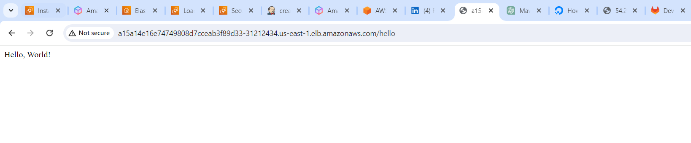

# Web-server-deployment-project


### create one maven project to deploy web server

- find a maven project for web server deployment
    - run maven commands
    - create a gitlab account
- create a docker container out of it
- Create a jenkins pipeline for CI
- Deploy the artifact to the nexus repository
- Deploy it as container on ec2 instance and test it
- Create EKS cluster
- deploy the docker image to kubernetes cluster
- create ingress and access the webserver from outside the kubernetes cluster

So here stage 1 is completed

I have the maven project 

- clone the project with command
    - git clone https://gitlab.com/devops5113843/web-server-deployment-project.git

- Run the following commands
    - mvn clean
    - mvn package

```
$ mvn package
[INFO] Scanning for projects...
[INFO] 
[INFO] -------------------< com.example:web-server-example >-------------------
[INFO] Building web-server-example 1.0-SNAPSHOT
[INFO]   from pom.xml
[INFO] --------------------------------[ jar ]---------------------------------
[INFO] 
[INFO] --- resources:3.3.1:resources (default-resources) @ web-server-example ---
[WARNING] Using platform encoding (UTF-8 actually) to copy filtered resources, i.e. build is platform dependent!
[INFO] skip non existing resourceDirectory C:\Users\Dell\gitlab\web-server-deployment-project\src\main\resources
[INFO]
[INFO] --- compiler:3.11.0:compile (default-compile) @ web-server-example ---
[INFO] Changes detected - recompiling the module! :source
[WARNING] File encoding has not been set, using platform encoding UTF-8, i.e. build is platform dependent!
[INFO] Compiling 1 source file with javac [debug target 1.8] to target\classes
[WARNING] bootstrap class path not set in conjunction with -source 8
[WARNING] source value 8 is obsolete and will be removed in a future release
[WARNING] target value 8 is obsolete and will be removed in a future release
[WARNING] To suppress warnings about obsolete options, use -Xlint:-options.
[INFO]
[INFO] --- resources:3.3.1:testResources (default-testResources) @ web-server-example ---
[WARNING] Using platform encoding (UTF-8 actually) to copy filtered resources, i.e. build is platform dependent!
[INFO] skip non existing resourceDirectory C:\Users\Dell\gitlab\web-server-deployment-project\src\test\resources
[INFO]
[INFO] --- compiler:3.11.0:testCompile (default-testCompile) @ web-server-example ---
[INFO] No sources to compile
[INFO]
[INFO] --- surefire:3.1.2:test (default-test) @ web-server-example ---
[INFO] No tests to run.
[INFO]
[INFO] --- jar:3.3.0:jar (default-jar) @ web-server-example ---
[INFO] Building jar: C:\Users\Dell\gitlab\web-server-deployment-project\target\web-server-example-1.0-SNAPSHOT.jar
[INFO] 
[INFO] --- assembly:3.3.0:single (make-assembly) @ web-server-example ---
[INFO] Building jar: C:\Users\Dell\gitlab\web-server-deployment-project\target\web-server-example-1.0-SNAPSHOT-jar-with-dependencies.jar
[INFO] ------------------------------------------------------------------------
[INFO] BUILD SUCCESS
[INFO] ------------------------------------------------------------------------
[INFO] Total time:  7.050 s
[INFO] Finished at: 2024-01-19T11:10:22+05:30
[INFO] ------------------------------------------------------------------------
```    
```
$ mvn exec:java
[INFO] Scanning for projects...
[INFO]
[INFO] -------------------< com.example:web-server-example >-------------------
[INFO] Building web-server-example 1.0-SNAPSHOT
[INFO]   from pom.xml
[INFO] --------------------------------[ jar ]---------------------------------
[INFO]
[INFO] --- exec:3.0.0:java (default-cli) @ web-server-example ---
SLF4J: Failed to load class "org.slf4j.impl.StaticLoggerBinder".
SLF4J: Defaulting to no-operation (NOP) logger implementation
SLF4J: See http://www.slf4j.org/codes.html#StaticLoggerBinder for further details.
```

- We will be able to see this on local machine on following url
    - http://localhost:8080/hello


### How to deploy it via docker in EC2 instance

```
# Use an official OpenJDK runtime as a base image
FROM openjdk:8-jre-alpine

# Set the working directory inside the container
WORKDIR /app

# Copy the JAR file into the container at /app
COPY target/web-server-example-1.0-SNAPSHOT-jar-with-dependencies.jar /app/

# Expose the port the app runs on
EXPOSE 8080

# Command to run your application
CMD ["java", "-jar", "web-server-example-1.0-SNAPSHOT-jar-with-dependencies.jar"]

```

- Build the Docker Image:
```
 docker build -t web-server-example .
```
- When you run the docker build command with the -t option to tag the image, the resulting Docker image is stored on your local machine. By default, Docker images are stored locally in the Docker daemon's image storage.

```
docker images
```
- Run the Docker Container:
```
docker run -p 8080:8080 web-server-example
```
- To run the container in detached mode (in the background), you can use the following command:
```
docker run -p 8080:8080 -d web-server-example
```
- If you want to see the logs of the running container, you can use the docker logs command:
```
docker logs <container_id_or_name>
```

### How To Deploy the microservice to EKS cluster

- With The help of groovy script in this project you will be able to create the docker image and upload it to ECR

- Create EKS cluster from this repo [here](https://gitlab.com/devops5113843/terraform-eks)

- Install kubectl on your machine 

```
[root create-eks-cluster]# aws configure
AWS Access Key ID [****************5OHB]: <access key id>
AWS Secret Access Key [****************7Jt9]: <secret key id>
Default region name [us-east-1]:
Default output format [None]:
[root create-eks-cluster]#
```
- Login to eks cluster 

```
aws eks update-kubeconfig --region us-east-1 --name my-eks-cluster
```
```
kubectl create ns test
```
### How to setup ECR and deploy image to EKS

- ECR Repository Policy : Ensure that your ECR repository has a policy that allows your EKS cluster to pull images.
The policy should include the EKS cluster's node IAM role.For example, create an ECR repository policy like this:

```
{
  "Version": "2008-10-17",
  "Statement": [
    {
      "Effect": "Allow",
      "Principal": {
        "Service": "ecr.amazonaws.com"
      },
      "Action": "ecr:GetAuthorizationToken"
    },
    {
      "Effect": "Allow",
      "Principal": {
        "Service": "ecr.amazonaws.com"
      },
      "Action": [
        "ecr:BatchCheckLayerAvailability",
        "ecr:GetDownloadUrlForLayer",
        "ecr:BatchGetImage"
      ]
    }
  ]
}
```

```
kubectl create secret docker-registry ecr-secret \
  --docker-server=ecr-repo-url \
  --docker-username=AWS \
  --docker-password="$(aws ecr get-login-password --region us-east-1)" \
  --docker-email=none@example.com -n test
```

- Deployment.yaml file 
```
apiVersion: apps/v1
kind: Deployment
metadata:
  name: your-deployment
spec:
  replicas: 1
  selector:
    matchLabels:
      app: your-app
  template:
    metadata:
      labels:
        app: your-app
    spec:
      containers:
        - name: your-container
          image: 23423424234234.dkr.ecr.us-west-1.amazonaws.com/docker-repository:latest
          ports:
            - containerPort: 8080
      imagePullSecrets:
        - name: ecr-secret
```

- service.yaml file

```
apiVersion: v1
kind: Service
metadata:
  name: your-service
spec:
  selector:
    app: your-app
  ports:
    - protocol: TCP
      port: 80
      targetPort: 8080
  type: LoadBalancer
```

```
kubectl get service -n test
NAME           TYPE           CLUSTER-IP       EXTERNAL-IP                                                             PORT(S)        AGE
your-service   LoadBalancer   10.100.195.215   adedeew132313scdscsdcds-211212assdsfsfsdd.us-east-1.elb.amazonaws.com   80:31915/TCP   52m
```

How to check:

```
http://adedeew132313scdscsdcds-211212assdsfsfsdd.us-east-1.elb.amazonaws.com/hello
```



### How to deploy ingress controller and access application using it

- You can check document here : https://kubernetes.github.io/ingress-nginx/deploy/#network-load-balancer-nlb ----> go to AWS section

```
kubectl apply -f https://raw.githubusercontent.com/kubernetes/ingress-nginx/controller-v1.8.2/deploy/static/provider/aws/deploy.yaml -n ingress-nginx
```

```
[root@ip-172-31-25-208 Kubernetes-deployments]#
[root@ip-172-31-25-208 Kubernetes-deployments]#  kubectl get all -n ingress-nginx
NAME                                            READY   STATUS      RESTARTS   AGE
pod/ingress-nginx-admission-create-tdn58        0/1     Completed   0          39m
pod/ingress-nginx-admission-patch-t7h8m         0/1     Completed   0          39m
pod/ingress-nginx-controller-68fb8cf9cc-mj9mn   1/1     Running     0          39m

NAME                                         TYPE           CLUSTER-IP       EXTERNAL-IP                                                                     PORT(S)                      AGE
service/ingress-nginx-controller             LoadBalancer   10.100.248.172   ad77a35f17d1746d0a62db02bb7f5229-3f82c3c988648419.elb.us-east-1.amazonaws.com   80:31241/TCP,443:32172/TCP   39m
service/ingress-nginx-controller-admission   ClusterIP      10.100.33.109    <none>                                                                          443/TCP                      39m

NAME                                       READY   UP-TO-DATE   AVAILABLE   AGE
deployment.apps/ingress-nginx-controller   1/1     1            1           39m

NAME                                                  DESIRED   CURRENT   READY   AGE
replicaset.apps/ingress-nginx-controller-68fb8cf9cc   1         1         1       39m

NAME                                       COMPLETIONS   DURATION   AGE
job.batch/ingress-nginx-admission-create   1/1           5s         39m
job.batch/ingress-nginx-admission-patch    1/1           6s         39m
[root@ip-172-31-25-208 Kubernetes-deployments]#
```

```
[root@ip-172-31-25-208 Kubernetes-deployments]# kubectl get ingress -n test
NAME           CLASS    HOSTS                                                                           ADDRESS                                                                         PORTS   AGE
your-ingress   <none>   ad77a35f17d1746d0a62db02bb7f5229-3f82c3c988648419.elb.us-east-1.amazonaws.com   ad77a35f17d1746d0a62db02bb7f5229-3f82c3c988648419.elb.us-east-1.amazonaws.com   80      3h22m
[root@ip-172-31-25-208 Kubernetes-deployments]#
```

```
[root@ip-172-31-25-208 Kubernetes-deployments]# kubectl get svc -n test
NAME           TYPE        CLUSTER-IP     EXTERNAL-IP   PORT(S)    AGE
your-service   ClusterIP   10.100.19.63   <none>        8080/TCP   4h33m
[root@ip-172-31-25-208 Kubernetes-deployments]#
```

- To Debug

```
kubectl logs ingress-nginx-controller-68fb8cf9cc-mj9mn -n ingress-nginx
```